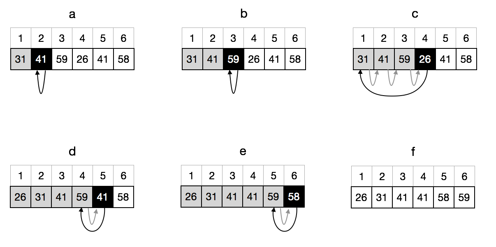
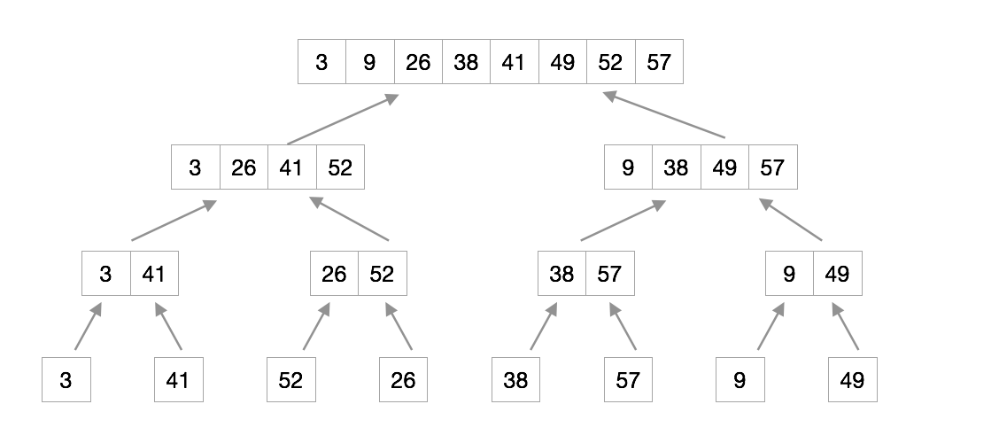

# 第2章 算法基础

## 2.1 插入排序

插入排序

```py
def insert_sort(nums):
    for j in range(1, len(nums)):
        key = nums[j]
        i = j-1
        while i >= 0 and nums[i] > key:
            nums[i+1] = nums[i]
            i -= 1
        nums[i+1] = key
    return nums
```

### 2.1-1

> Using Figure 2.2 as a model, illustrate the operation of INSERTION-SORT on the array A=<31, 41, 59, 26, 41, 58>.



### 2.1-2

> Rewrite the INSERTION-SORT procedure to sort into nonincreasing instead of non- decreasing order.

```py
def insert_sort_noincrease(nums):
    for j in range(1, len(nums)):
        key = nums[j]
        i = j-1
        while i >= 0 and nums[i] < key:
            nums[i+1] = nums[i]
            i -= 1
        nums[i+1] = key
```

### 2.1-3

```py
def linear_search(nums, target):
    for i, x in enumerate(nums):
        if x == target:
            return i
    return None
```

证明：

1. 初始：在迭代之前，数组就是循环不变体，它初始状态不变
2. 保持：每次迭代时，都不会对数组做任何修改
3. 终止：当搜寻到目标值时，迭代终止，循环不变体没有变化

### 2.1-4

```
形式化描述：

输入：有两个长度为 n 的二进制序列，A=<a1, a2, ..., an>，B=<b1, b2, ..., bn>，其中任意元素ai 和 bi 的值为 0 或 1

输出：长度为 n+1 的序列 C, 满足 C=A+B（各对应位置的元素相加，1+1会有进位）
```

```py
def binary_add(A, B):
    C = [0] * (len(A)+1)
    carry = 0
    for i in range(len(A)-1, -1, -1):
        sum = A[i] + B[i] + carry
        C[i+1] = sum % 2
        carry = sum // 2
    C[i] = carry
    return C
```

## 2.1 分析算法

### 2.2-1

O(n^3)

### 2.2-2

伪代码：

```py
def select_sort(nums):
    for i in range(len(nums)-1):
        min_index = i
        for j in range(i+1, len(nums)):
            if nums[j] < nums[min_index]:
                min_index = j
        nums[i], nums[min_index] = nums[min_index], nums[i]
```

总共有 n 个数，取出 n-1 个最小的数，最后剩下的一个就是最大的数。

循环不变式：每次迭代都是从一个无序列表开始

最好的情况和最坏的情况一样，都需要做 n(n+1)/2 次比较，和 n-1 次交换。运行时间为 O(n^2)。

### 2.2-3

线性查找，假设已排序数组里有一半不比它大，另一半不比它小。那平均要 n/2 步找到目标，记为 O(n/2)。

最坏的情况是目标不在数组里，需要查找 n 次，记为 O(n)。

### 2.2-4

如果只针对「最好情况」做优化，那就考虑在最好的情况下做最少的事情。

对于排序来说，一次遍历能够证明它是已排好序的，运行时间为 O(n)。

## 2.1 设计算法

归并排序

```py
def merge(A, p, q, r):
    L = A[p:q+1]
    R = A[q+1:r+1]
    L.append(float('inf'))
    R.append(float('inf'))
    i = j = 0
    for k in range(p, r+1):
        if L[i] <= R[j]:
            A[k] = L[i]
            i += 1
        else:
            A[k] = R[j]
            j += 1


def merge_sort(nums, p, r):
    if p < r:
        q = (p+r)//2
        merge_sort(nums, p, q)
        merge_sort(nums, q+1, r)
        merge(nums, p, q, r)
```

### 2.3-1



### 2.3-2

```py
def merge(A, p, q, r):
    L = A[p:q+1]
    R = A[q+1:r+1]
    i = j = 0
    k = p
    while i < len(L) and j < len(R):
        if L[i] <= R[j]:
            A[k] = L[i]
            i += 1
        else:
            A[k] = R[j]
            j += 1
        k += 1

    while i < len(L):
        A[k] = L[i]
        i += 1
        k += 1

    while j < len(R):
        A[k] = R[j]
        j += 1
        k += 1


def merge_sort(nums, p, r):
    if p < r:
        q = (p+r)//2
        merge_sort(nums, p, q)
        merge_sort(nums, q+1, r)
        merge(nums, p, q, r)
```

### 2.3-3

证明


### 2.3-4

插入排序递归版本的最坏情况递归式

1. `T(n) = O(1)  若 n=1`， 插入第一张牌，时间固定 O(1)
2. `T(n) = T(n-1) + O(n)  若 n>1`，时间分为两部分，第一部分为 T(n-1) 是之前 n-1 张牌排序花的时间。第二部分为 O(n)，跟之前的 n-1 张牌比较花的时间。

### 2.3-5

二分法

递归

```py
def binary_search(nums, target, l=0, r=None):
    if r is None:
        r = len(nums)-1

    if l > r:
        return -1

    mid = (l+r)//2
    if nums[mid] == target:
        return mid
    elif nums[mid] > target:
        return binary_search(nums, target, l, mid-1)
    else:
        return binary_search(nums, target, mid+1, r)
```

迭代

```py
def binary_search(nums, target, l=0, r=None):
    if r is None:
        r = len(nums)-1
    while l <= r:
        mid = (l+r)//2
        if nums[mid] == target:
            return mid
        elif nums[mid] > target:
            r = mid-1
        else:
            l = mid+1
    return -1
```

证明最坏的情况运行时间为 O(lgn)

### 2.3-6

不能。

1. 在插入排序中使用二分法来查找插入点，可以使「查找插入点」这个操作的运行时间由 O(n) 变为 O(lgn)
2. 但是找到插入点之后还有一系列的「移动」操作，这个运行步骤并没有减少。最终的运行时间仍为 O(n^2)

### 2.3-7

题目描述：

输入：一个有 n 个整数的数组 S，一个目标整数 x
输出：S 中的两个元素 a 和 b，满足 `a+b = x`

```
def binary_search(nums, target, l=0, r=None):
    if r is None:
        r = len(nums)-1
    while l <= r:
        mid = (l+r)//2
        if nums[mid] == target:
            return mid
        elif nums[mid] > target:
            r = mid-1
        else:
            l = mid+1
    return -1

def twoSum(nums, x):
    nums.sort()
    for i in range(len(nums)):
        target = x-nums[i]
        j = binary_search(nums, target, i+1)
        if j != -1:
            return [nums[i], nums[j]]
```

排序的时间为 O(nlgn)，采用快排或归并排序。

二分查找的运行时间为 O(lgn)，外层循环次数为 n，合起来就是 O(nlgn)。

总的运行时间为 O(nlgn + nlgn) = O(2nlgn) ，去掉常数就是 O(nlgn)。

## 练习

### 2-1
### 2-2
### 2-3
### 2-4


