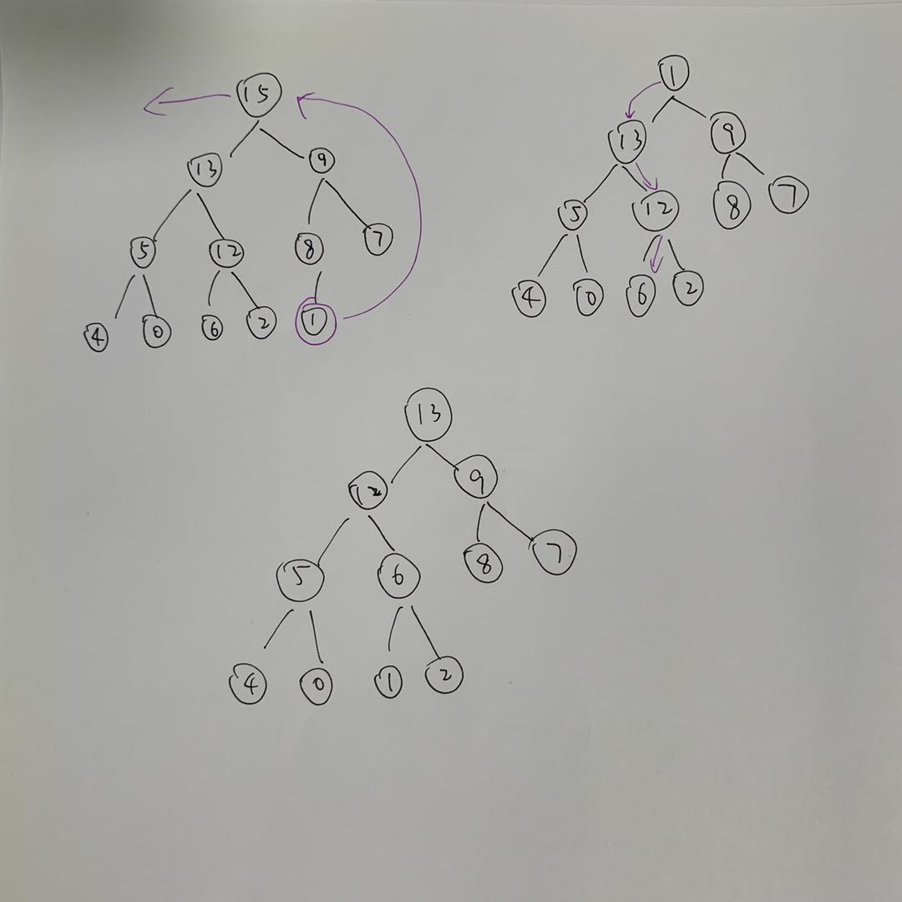

# 堆排序

## 6.1 堆

### 6.1-1
> 在高度为 h 的堆中，元素个数最多和最少分别是多少？

最多：`2^h + 2^(h-1) + ... + 2^1 + 2^0` = `2^(h+1) - 1`
最少：`2^(h-1) + ... + 2^1 + 2^0 + 1` = `2^h`

    

### 6.1-2

### 6.1-3

### 6.1-4

最小元素位于叶节点上，任一个叶节点都有可能。

### 6.1-5

> 一个已排好序的数组是一个最小堆吗

是的。

### 6.1-6

不是。画出二叉树图即可见 7 的父节点是 6，不符合最大堆性质。

### 6.1-7


## 6.2 维护堆的性质

翻译成 Python 代码，数组下标从 0 开始，可以运行这个例子看看中间步骤的结果。

```py
def left(i):
    return 2*(i+1)-1


def right(i):
    return 2*(i+1)


def parent(i):
    return (i-1) >> 1
    
    
def max_heapify(nums, i):
    l = left(i)
    r = right(i)
    if l < len(nums) and nums[l] > nums[i]:
        largest = l
    else:
        largest = i
    if r < len(nums) and nums[r] > nums[largest]:
        largest = r
    if largest != i:
        nums[i], nums[largest] = nums[largest], nums[i]
        max_heapify(nums, largest)


A = [16, 4, 10, 14, 7, 9, 3, 2, 8, 1]
max_heapify(A, 1)
```

### 6.2-1


### 6.2-2

```py
def min_heapify(nums, i):
    l = left(i)
    r = right(i)
    least = i
    if l < len(nums) and nums[l] < nums[i]:
        least = l
    if r < len(nums) and nums[r] < nums[least]:
        least = r
    if least != i:
        nums[i], nums[least] = nums[least], nums[i]
        min_heapify(nums, least)
```

min_heapify 跟 max_heapify 运行时间一样。

### 6.2-3

A[i] 比 left, right 都大，那么 max_heapify 一次调用就会结束，不会发生递归调用。

结果仍然是正确的（因为前提已经是假设 left, right 都已经是各自为顶点的最大堆）。

### 6.2-4

数组不会有任何改变。因为元素是个叶节点，它的 left 和 right 都超出了数组范围。

### 6.2-5

迭代版本

```py
def max_heapify_iteration(nums, i):
    while True:
        l = left(i)
        r = right(i)
        if l < len(nums) and nums[l] > nums[i]:
            largest = l
        else:
            largest = i
        if r < len(nums) and nums[r] > nums[largest]:
            largest = r
        if largest == i:
            break
        else:
            nums[i], nums[largest] = nums[largest], nums[i]
            i = largest
```

### 6.2-6

    最坏情况是对于元素，每次它下沉后，都有子节点比它大，于是要继续下沉。
    
    最大的下沉高度就是堆的高度，即 lgn，所以运行时间为 O(lgn)。
    
    
## 6.3 建堆

构建最大堆，完整代码：

```py
def heapify_max(A, i):
    l = 2*i + 1
    r = 2*i + 2
    largest = i
    if l < len(A) and A[l] > A[largest]:
        largest = l
    if r < len(A) and A[r] > A[largest]:
        largest = r
    if largest != i:
        A[largest], A[i] = A[i], A[largest]
        heapify_max(A, largest)


def build_max_heap(A):
    n = len(A)
    for i in reversed(range(n//2)):
        heapify_max(A, i)
```

构建最小堆：

```py
def heapify(A, i):
    l = 2*i+1
    r = 2*i+2
    least = i
    if l < len(A) and A[l] < A[least]:
        least = l
    if r < len(A) and A[r] < A[least]:
        least = r
    if least != i:
        A[least], A[i] = A[i], A[least]
        heapify(A, least)


def build_min_heap(A):
    n = len(A)
    for i in reversed(range(n//2)):
        heapify(A, i)
```

### 6.3-1


### 6.3-2

如果从 1 开始的话，那么最后的堆顶只会在 A[1], A[2], A[3] 这三者之间了。而这三者可能不会是数组里的最大值，题 6.3-1 可作为例子。


## 6.4 堆排序算法

前边都没有注意 heap_size，在执行排序动作的时候，它有非常重要的作用。

没办法再给一个 list 对象添加 heap_size 成员了，所以这里用了内嵌函数，可以把 heap_size 包在主函数内部。

```py
def heap_extrace_max(A):
    last = A.pop()
    if A:
        res = A[0]
        A[0] = last
        heapify_max(A, 0)
        return res
    return last


def heap_sort(A):
    build_max_heap(A)
    res = []
    while A:
        res.append(heap_extrace_max(A))
    return res
```

## 6.5 优先队列

### 6.5-1



### 6.5-2


### 6.5-3

按照书中的写法，换成 python，数组下标从 0 开始。

```py
def heapify(A, i):
    l = 2*i+1
    r = 2*i+2
    least = i
    if l < len(A) and A[l] < A[least]:
        least = l
    if r < len(A) and A[r] < A[least]:
        least = r
    if least != i:
        A[least], A[i] = A[i], A[least]
        heapify(A, least)


def build_min_heap(A):
    n = len(A)
    for i in reversed(range(n//2)):
        heapify(A, i)


def heap_minmum(A):
    return A[0]


def heap_extract_min(A):
    last = A.pop()
    if A:
        res = A[0]
        A[0] = last
        heapify(A, 0)
        return res
    return last


def heap_decrease_key(A, i, key):
    if key > A[i]:
        raise ValueError
    A[i] = key
    parent_pos = (i-1) >> 1
    while i > 0 and A[parent_pos] > A[i]:
        A[parent_pos], A[i] = A[i], A[parent_pos]
        i = parent_pos
        parent_pos = (i-1) >> 1


def min_heap_insert(A, key):
    A.append(float('inf'))
    heap_decrease_key(A, len(A)-1, key)
```

### 6.5-4

按书中写法，其实 `A[A.heap-size] = key` 也可以。即使相等，`HEAP_INCREASE_KEY()` 函数也会做一次提升。

### 6.5-5

### 6.5-6

```py
def heap_increate_key(A, i, key):
    if key < A[i]:
        raise ValueError
    parent_pos = (i-1) >> 1
    while i > 0 and A[parent_pos] < key:
        A[i] = A[parent_pos]
        i = parent_pos
        parent_pos = (i-1) >> 1
    A[i] = key
```

### 6.5-7

FIFO：添加时使用 tuple，第一个元素是 order，每添加一个元素 order 加 1
STACK：每添加一个元素 order 减 1

### 6.5-8

```py
def heap_delete(A, i):
    last = A.pop()
    if A[i] > last:
        A[i] = last
        heapify_max(A, i)
    else:
        heap_increase_key(A, i, last)
```

如果尾元素较小，则只考虑下沉。若尾元素更大，只考虑提升。

### 6.5-9

此题在 leetcode 上也有，[23. 合并K个排序链表](https://leetcode-cn.com/problems/merge-k-sorted-lists/)

贴一下题解。在 python 里比较巧妙的是给 ListNode 添加了比较运算符，这样就可以像普通整型一样来操作，自然流畅。

```py
class Solution:
    def mergeKLists(self, lists: List[ListNode]) -> ListNode:

        ListNode.__lt__ = lambda self, other: self.val < other.val

        import heapq
        heap = []
        p = head = ListNode(0)
        for x in lists:
            if x:
                heapq.heappush(heap, x)
        while heap:
            p.next = heapq.heappop(heap)
            p = p.next
            if p.next:
                heapq.heappush(heap, p.next)
        return head.next
```

## 思考题

### 6.1

### 6.2

### 6.3

从左上角往右下看，是一个最小堆。

#### a

| 2 | 3 | 8 | ∞ |
| --- | --- | --- | --- |
| 4 | 9 | 16 |  ∞ |
| 12 | 14 |  ∞ |  ∞ |
| 5 |  ∞ |  ∞ |  ∞ |

#### b

#### c

#### d

#### e

#### f


