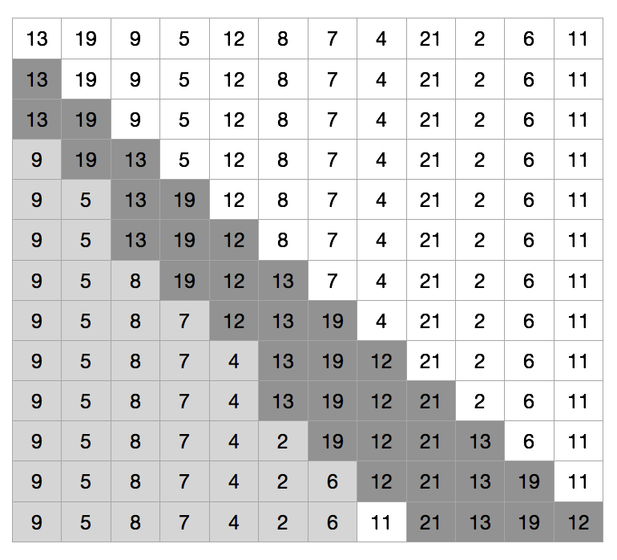

# 7 快速排序

## 7.1 快速排序的描述

```py
def partition(A, p, r):
    x = A[r]
    i = p-1
    for j in range(p, r):
        if A[j] <= x:
            i += 1
            A[j], A[i] = A[i], A[j]
    A[i+1], A[r] = A[r], A[i+1]
    return i+1


def quick_sort(A, p, r):
    if p < r:
        q = partition(A, p, r)
        quick_sort(A, p, q-1)
        quick_sort(A, q+1, r)
```

### 7.1-1



### 7.1-2

    如果 A[p..r] 里的元素都相同，PARTITION 返回 r。
    
### 7.1-3
    
### 7.1-4

```py
def partition(A, p, r):
    x = A[r]
    i = p-1
    for j in range(p, r):
        if A[j] > x:  # <- 改这一行
            i += 1
            A[j], A[i] = A[i], A[j]
    A[i+1], A[r] = A[r], A[i+1]
    return i+1
```

