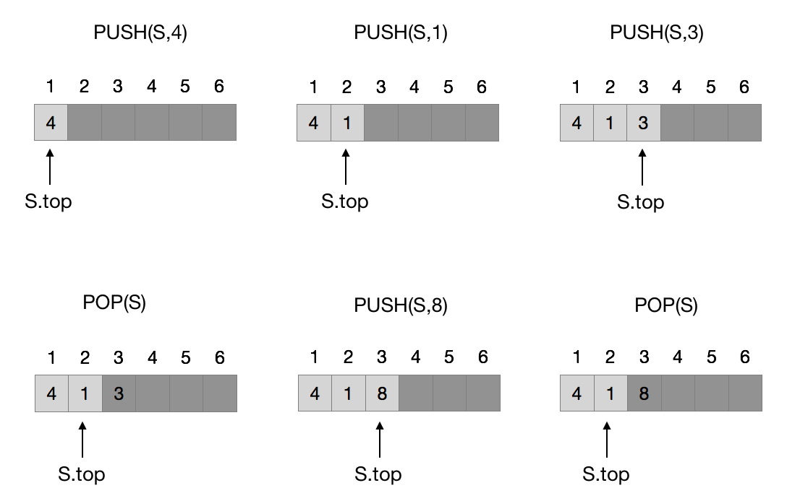
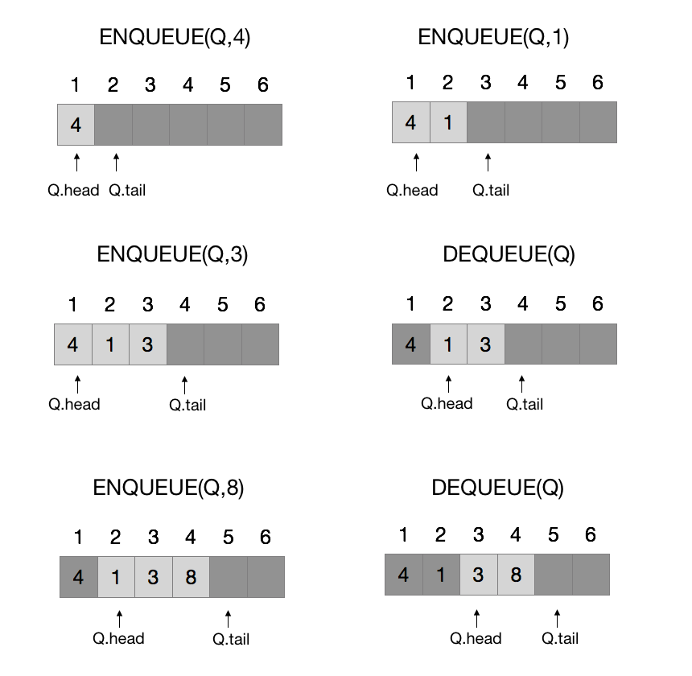

# 10 基本数据结构

## 10.1 栈和队列

书中的数组下标从 1 开始， top 指向栈中最新插入的元素，这样比较自然。

实际实现时由于数组下标从 0 开始，所以把 top 定义为指向下一个插入的元素位置。这样初始 top = 0 ，会更好实现一点。

```py
class Stack:
    def __init__(self):
        self.data = []
        self.top = 0

    def empty(self):
        return self.top == 0

    def push(self, x):
        self.top += 1
        self.data.append(x)

    def pop(self):
        if self.empty():
            raise StopIteration
        self.top -= 1
        return self.data[self.top]
    ```

### 10.1-1



### 10.1-2

> 在一个数组 A[1..n] 上实现两个栈，当两个栈元素个数之和不为 n 时都不会发生上溢。要求 PUSH 和 POP 操作的运行时间为 O(1)

两个栈的栈顶分别为数组的首尾两端，压入数据后 S.top 向中间靠拢。

在下面的 python 实现中，top1 和 top2 都指向下一个将要插入的位置。所以当 top1 == top2 的时候，意味着数组剩下最后一个还没占用的空间。而当 top1 > top2 的时候，意味着数组满了。

```py
class TwoStack:
    def __init__(self, n):
        self.data = [0] * n
        self.top1 = 0
        self.top2 = n-1

    def full(self):
        return self.top1 > self.top2

    def push_stack1(self, x):
        if self.full():
            raise IndexError
        self.data[self.top1] = x
        self.top1 += 1

    def push_stack2(self, x):
        if self.full():
            raise IndexError
        self.data[self.top2] = x
        self.top2 -= 1

    def pop_stack1(self):
        if self.top1 == 0:
            raise IndexError
        self.top1 -= 1
        return self.data[self.top1]

    def pop_stack2(self):
        if self.top2 == len(self.data)-1:
            raise IndexError
        self.top2 += 1
        return self.data[self.top2]
```

### 10.1-3



### 10.1-4

队列处理上溢和下溢

```py
class Queue:
    def __init__(self, size):
        self.size = size+1
        self.data = [0] * self.size
        self.head = 0
        self.tail = 0

    def empty(self):
        return self.head == self.tail

    def full(self):
        tail = (self.tail+1) % self.size
        return tail == self.head

    def enqueue(self, x):
        if self.full():
            raise IndexError
        self.data[self.tail] = x
        self.tail = (self.tail+1) % self.size

    def dequeue(self):
        if self.empty():
            raise IndexError
        x = self.data[self.head]
        self.head = (self.head+1) % self.size
        return x
```

### 10.1-5

双向队列

```py
class Deque:
    def __init__(self, n):
        self.size = n+1
        self.data = [0]*self.size
        self.tail = 0
        self.head = 0

    def full(self):
        tail = (self.tail+1) % self.size
        return tail == self.head

    def empty(self):
        return self.head == self.tail

    def pushright(self, x):
        if self.full():
            raise IndexError
        self.data[self.tail] = x
        self.tail = (self.tail+1) % self.size

    def popright(self):
        if self.empty():
            raise IndexError
        if self.tail == 0:
            self.tail = self.size-1
        else:
            self.tail -= 1
        return self.data(self.tail)

    def pushleft(self, x):
        if self.full():
            raise IndexError
        if self.head == 0:
            self.head = self.size-1
        else:
            self.head -= 1
        self.data[self.head] = x

    def popleft(self):
        if self.empty():
            raise IndexError
        x = self.data[self.head]
        self.head = (self.head+1) % self.size
        return x
```

### 10.1-6

两个栈实现一个队列

解法：

队列要求先入先出。准备两个栈 A 和 B：

* enqueue 就往 A 里 push
* dequeue 就从栈 B pop，如果 B 中为空，则逐个从 A 中 pop 出来再压进栈 B 中。

下面的实现不对队列的大小做限制，所以不存在队列满的情况。

```py
class MyQueue:
    def __init__(self):
        self.A = []
        self.B = []

    def empty(self):
        return not self.A and not self.B

    def enqueue(self, x):
        self.A.append(x)

    def dequeue(self):
        if self.empty():
            raise IndexError
        if not self.B:
            while self.A:
                self.B.append(self.A.pop())
        return self.B.pop()
```

### 10.1-7

两个队列实现一个栈

栈要求后入先出。

准备两个队列 A 和 B，压栈 push 就往 A 里 enqueue，pop() 就先把 A 里的数据取出放入 B 中，直到剩下最后一个就是要 pop 的元素。队列 B 的作用就是临时用来存储一下元素。

```py
class MyStack:
    def __init__(self):
        self.A = SimpleQueue()
        self.B = SimpleQueue()

    def empty(self):
        return self.A.empty()

    def push(self, x):
        self.A.put(x)

    def pop(self):
        while self.A.qsize() > 1:
            self.B.put(self.A.get())
        x = self.A.get()
        while not self.B.empty():
            self.A.put(self.B.get())
        return x
```


